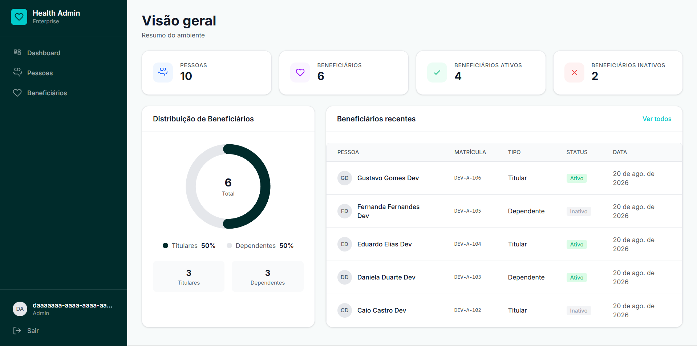
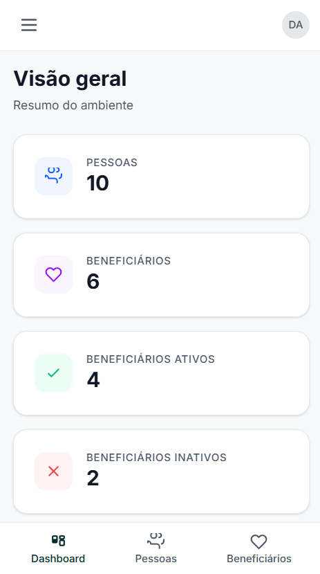
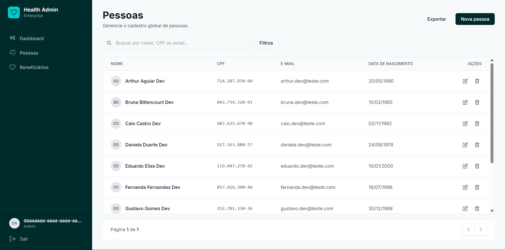
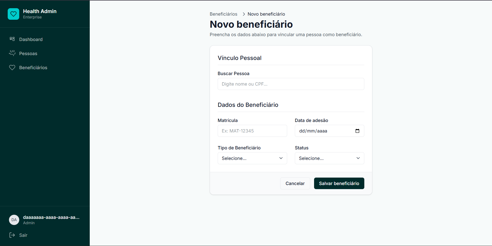

# Multi-Tenant Platform - Front-End

Bem-vindo à documentação técnica do Front-End da Plataforma Multi-Tenant. Este documento registra a arquitetura, as decisões técnicas e o modelo de desenvolvimento adotados para a construção desta interface.

---

## 1. Contexto do Produto

A aplicação Front-End faz parte de uma plataforma multi-tenant projetada para o gerenciamento de Pessoas e Beneficiários.

Neste contexto, o domínio estabelece que:
- **Pessoa:** É uma entidade **global** na plataforma.
- **Beneficiário:** É uma entidade vinculada a uma Pessoa e a um **Tenant** específico. Uma mesma Pessoa pode ter múltiplos vínculos de Beneficiário em diferentes Tenants.

### Isolamento Multi-Tenant e Segurança
Um princípio fundamental desta arquitetura é que **o isolamento de dados é responsabilidade exclusiva do Backend (API)**. 
O Front-End consome a API enviando o token JWT do usuário, e a API utiliza o contexto do Tenant associado a esse token para garantir que um Tenant não acesse os dados (Beneficiários) de outro.

O Front-End **não implementa lógica de isolamento de dados no cliente**, limitando-se a respeitar o contrato da API e reagir adequadamente às respostas de autorização (403 Forbidden e 401 Unauthorized).

---

## 2. História e Idealização

A interface foi concebida para ser uma ferramenta **administrativa, limpa e objetiva**. 
Foi projetada visando um ambiente corporativo de gestão, onde a produtividade e a clareza da informação são essenciais.

Privilegiou-se:
- **Hierarquia visual clara:** Menus de fácil acesso (Sidebar) e tabelas padronizadas.
- **Consistência:** Uso de um Design System simplificado com componentes reutilizáveis.
- **Experiência Responsiva:** Layout que se adapta a dispositivos Mobile e Desktop, garantindo funcionalidade em múltiplos cenários de uso.
- **Feedback Constante:** Implementação de Toasts, loaders e StateFeedbacks para comunicar o estado das operações ao usuário.

---

## 3. Arquitetura do Front-End

A aplicação foi construída com foco em simplicidade, baixa complexidade e facilidade de manutenção (princípios KISS e YAGNI).

### Stack Tecnológico
- **Vue 3 (Composition API / `<script setup>`):** Para reatividade e componentização moderna.
- **TypeScript:** Garantindo tipagem estática, contratos claros com a API e maior segurança no desenvolvimento.
- **Vite:** Ferramenta de build de altíssima performance.
- **Vue Router:** Para controle de navegação e rotas (Single Page Application).
- **Tailwind CSS v4:** Framework utilitário para estilização ágil e responsiva.
- **Axios:** Cliente HTTP para comunicação com o Backend.

*Nota:* Optou-se por **não utilizar uma store global** pesada (como Pinia ou Vuex) para evitar abstrações desnecessárias em um projeto onde os estados compartilhados (como auth e toast) puderam ser perfeitamente resolvidos utilizando *Composables* nativos do Vue 3.

### Estrutura de Diretórios
O projeto segue uma arquitetura orientada a componentes (inspirada no Atomic Design) e separação de responsabilidades:

```text
frontend/
├── Dockerfile
├── nginx.conf
├── package.json
├── tailwind.config.js
├── vite.config.ts
└── src/
    ├── assets/       # Estilos globais (style.css), imagens
    ├── components/   # Design System (Atomic Design)
    │   ├── atoms/      # Avatar, Badge, Button, Icon, Input, Select, Toast
    │   ├── molecules/  # ConfirmDialog, NavItem, Pagination, SearchInput, StateFeedback
    │   └── organisms/  # Card, Modal, Table
    ├── composables/  # Lógica reativa reutilizável (useAuth, useToast)
    ├── layouts/      # Layouts das páginas (AdminLayout)
    ├── router/       # Configuração de rotas e Navigation Guards
    ├── services/     # Integração com a API (api.ts, pessoa.service.ts, auth.service.ts)
    └── views/        # Páginas da aplicação (Dashboard, Pessoas, Beneficiarios, Login)
```

---

## 4. Design System e UI/UX

Para evitar duplicação visual e manter a interface coesa, os elementos visuais foram abstraídos em componentes independentes.

### Componentes Chave (Atomic Design)
- **Atoms:** Componentes base como `Button`, `Input`, `Select`, `Badge` (para exibir status ativo/inativo), `Icon` e `Toast`.
- **Molecules:** Componentes que unem átomos, como `Pagination`, `ConfirmDialog` e `SearchInput`. Destaca-se o `StateFeedback`, usado para exibir estados de "Loading" ou "Empty State" de forma padronizada.
- **Organisms:** Elementos mais complexos como `Table` (para listagem de Pessoas e Beneficiários) e `Modal`.

### UI/UX e Responsividade
- **Sidebar & Mobile Menu:** A navegação administrativa (`AdminLayout`) possui um sidebar em telas grandes, que colapsa para um menu "hamburguer" no mobile, garantindo que o conteúdo principal ocupe o espaço necessário.
- **Formulários e Cards:** Organizados em grids responsivos que se ajustam desde o smartphone até monitores ultrawide.
- **Feedbacks:** A interface nunca deixa o usuário no escuro. Operações de CRUD sempre retornam mensagens de sucesso ou erro (Toast), e há confirmação explícita (`ConfirmDialog`) antes de exclusões.

---

## 5. Dashboard

O Dashboard centraliza as informações mais importantes da plataforma para o usuário autenticado.

- **KPIs (Key Performance Indicators):** Exibe métricas como o total de Pessoas cadastradas, Pessoas inativas/ativas e outros dados agregados.
- **Integração Real:** Os dados são consumidos dos endpoints reais da API através dos services, muitas vezes utilizando paralelismo (e.g., `Promise.all`) para reduzir o tempo de tela de carregamento.


> **Figura 1 — Dashboard Desktop**


> **Figura 2 — Dashboard Mobile**

---

## 6. Pessoas e Beneficiários (CRUD)

A aplicação gerencia separadamente Pessoas e Beneficiários.

### Pessoas
- **Listagem:** Tabela paginada.
- **Ações:** Criação, Edição e Exclusão.
- **Regra de Negócio Crítica:** Uma Pessoa (global) não pode ser excluída caso tenha vínculos de Beneficiários em qualquer Tenant. Quando a API bloqueia a exclusão por conflito (HTTP 409), o Front-End intercepta e apresenta o conflito claramente ao usuário.

### Beneficiários
- **Listagem e Associação:** Associa-se Beneficiários a Pessoas. O Beneficiário é criado diretamente no Tenant atual.
- **Filtros e Paginação:** Listas longas são otimizadas consumindo endpoints paginados (com uso das propriedades `size`, `page` e `totalElements`), impedindo gargalos de performance e problema de N+1 no cliente.


> **Figura 3 — Listagem de Pessoas (Desktop)**


> **Figura 4 — Formulário de Beneficiário (Desktop)**

---

## 7. Integração com a API

A comunicação com a API está estritamente contida no diretório `/services`. A escolha por isolar os serviços impede que as Views façam requisições diretamente, garantindo o Single Responsibility Principle (SRP).

- **Instância Axios (`api.ts`):** 
  O cliente HTTP possui configuração centralizada de `baseURL` consumida das variáveis de ambiente.
- **Interceptors:**
  - **Request:** Injeta automaticamente o cabeçalho `Authorization: Bearer <token>` em todas as requisições se houver sessão ativa.
  - **Response:** Tratamento global de erros. Captura automaticamente erros 401 (removendo o token e redirecionando para `/login`), 403 (exibindo toast de falta de permissão) e 500+ (erros inesperados no servidor).

---

## 8. Autenticação, Segurança e Tratamento de Erros

A autenticação é garantida pelo uso de tokens JWT obtidos no login e guardados temporariamente no `sessionStorage` (ou `localStorage`).

- **Guards de Rota:** O Vue Router foi configurado com `meta: { requiresAuth: true }`. O guard (`router.beforeEach`) checa a presença de autenticação antes de qualquer navegação restrita.
- **Tratamento de Erros:**
  - **401 Unauthorized:** Redireciona o usuário para reautenticação.
  - **403 Forbidden:** Informa violação de acesso ao Tenant sem quebrar a aplicação.
  - **404 Not Found:** Tratado com a view genérica `NotFoundView.vue`.
  - **409 Conflict:** Utilizado em regras de negócio (ex: deleção de Pessoa vinculada) exibido por Toasts disparados diretamente no componente.

---

## 9. Infraestrutura (Docker e Nginx)

O Front-End foi preparado para ser construído (build) e servido (served) como imagem Docker, garantindo portabilidade entre ambientes (Dev, Staging, Produção).

### Fluxo de Build (Multi-stage Dockerfile)
1. **Stage 1 (Builder):** Usa imagem Node (Alpine) para baixar dependências (`npm ci`) e fazer o build via Vite (`npm run build`). As variáveis de ambiente (`VITE_API_URL`) são injetadas nesse momento.
2. **Stage 2 (Servidor):** Usa Nginx (Alpine) copiando apenas a pasta `/dist` gerada. O código fonte original não vai para a imagem final.

### Configuração Nginx (`nginx.conf`)
Como o Vue.js gera uma Single Page Application (SPA), o Nginx é instruído a fazer fallback para `index.html` caso uma rota do Vue seja acessada diretamente:
```nginx
try_files $uri $uri/ /index.html;
```

---

## 10. Decisões Arquiteturais e Trade-offs

- **Decisão:** Uso do Composition API e `<script setup>` no Vue 3.
  - **Motivo / Benefício:** Sintaxe mais enxuta, melhor suporte ao TypeScript e reatividade explícita.
- **Decisão:** Ausência de Store Global (Vuex/Pinia).
  - **Motivo / Benefício:** A complexidade da aplicação não exigiu gerenciamento de estados massivos compartilhados entre componentes que não pudessem ser resolvidos por Composables (ex: `useAuth`). Mantém a aplicação mais leve.
  - **Trade-off:** Se a aplicação escalar para precisar de cache complexo no cliente, uma Store precisará ser adotada no futuro.
- **Decisão:** Isolamento de Tenant no Backend.
  - **Motivo / Benefício:** A segurança real fica na camada da API. O cliente não confia nos próprios dados para garantir restrições de acesso.
- **Decisão:** Tailwind CSS v4.
  - **Motivo / Benefício:** Agilidade na construção visual sem precisar criar arquivos CSS customizados para cada componente, ajudando a padronizar medidas (Atomic CSS).

---

## 11. Problemas Encontrados e Soluções

Durante o desenvolvimento, desafios de usabilidade e arquitetura foram mitigados:

- **Problema:** Exclusão acidental de Pessoa vinculada a Beneficiários.
  - **Solução:** Implementação do componente `ConfirmDialog` no Front-End para confirmação de duplo passo e tratamento proativo de HTTP 409 proveniente da API.
- **Problema:** Layout quebrando no Desktop ao fazer scroll com Sidebar longo.
  - **Solução:** Ajuste das propriedades CSS/Tailwind no `AdminLayout` para manter o Sidebar fixo (altura `100vh`) com scroll independente do conteúdo principal.
- **Problema:** Perda da navegação em reloads na SPA via Docker.
  - **Solução:** Adição do diretório `/nginx.conf` e injeção do fallback `try_files` no container Nginx.

---

## 12. Validação e Testes

A saúde do código é validada através do compilador do TypeScript (Type-Checking) e do bundler do Vite.

- **Type-Check & Build:** `npm run build` (Executa `vue-tsc -b` seguido por `vite build`). Garante que não existam furos de tipagem no momento de gerar os assets estáticos.
- **Dev Server:** `npm run dev` para hot-module replacement rápido em ambiente local.

---

## 13. Resultado Final

O Front-End da Plataforma Multi-Tenant foi entregue consolidando um produto de software robusto e focado no usuário. A aplicação é capaz de:
- Consumir endpoints de forma paginada e segura;
- Autenticar usuários via JWT;
- Respeitar, por reflexo da API, o contexto do tenant em vigor;
- Gerenciar o CRUD complexo de Pessoas e Beneficiários;
- Prover um Design System consistente com excelente capacidade responsiva;
- Reagir com feedbacks de estado apropriados para o usuário, encapsulando falhas da rede ou do servidor elegantemente.
- Ser facilmente implantada em qualquer infraestrutura baseada em containers (Docker/Nginx).

O resultado é uma base de código modularizada, estritamente tipada com TypeScript, construída para fácil manutenção e escala arquitetural em demandas corporativas futuras.
